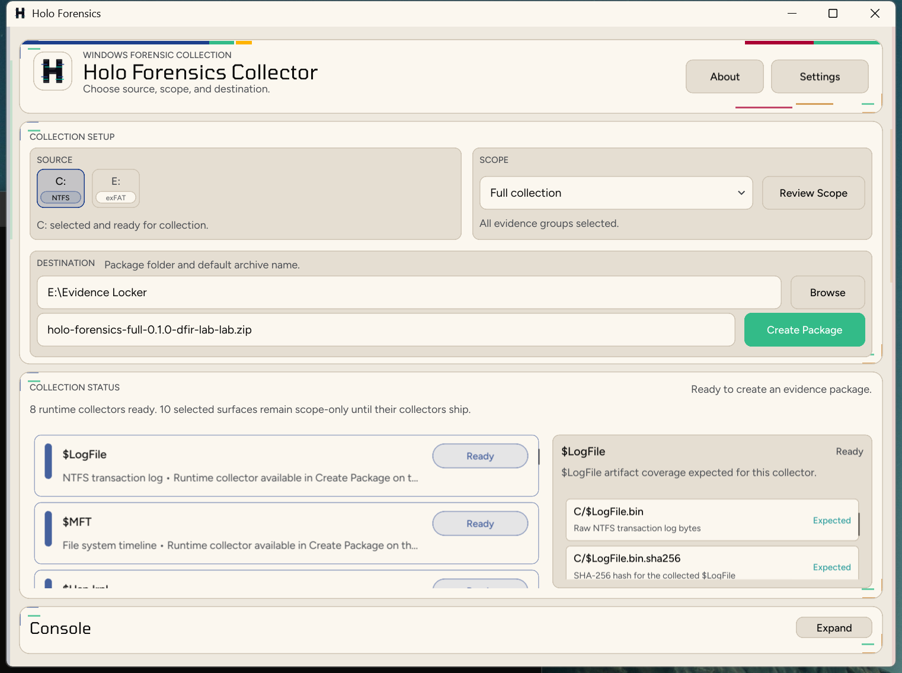
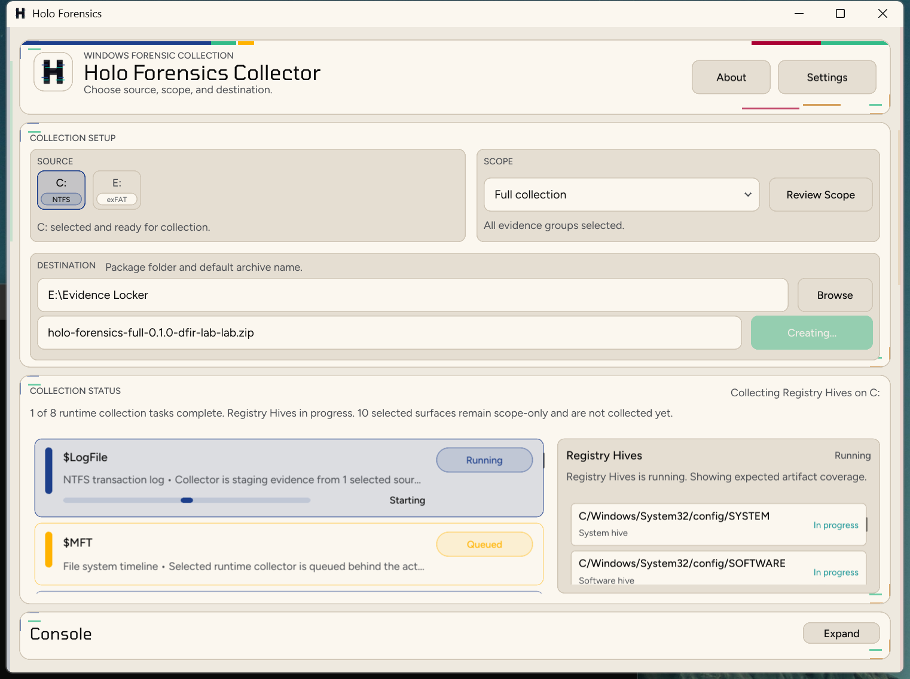

<p align="center">
  
</p>

# Holo Forensics

Consistent Windows forensic collection and offline artifact parsing in one Rust codebase.



Holo Forensics exists because too much free forensic acquisition tooling is stitched together from mixed languages, PowerShell scripts, batch wrappers, and external utilities. That can work, but it makes collection behavior harder to audit, harder to reproduce, and harder to trust across machines.

This project takes a narrower path: one open-source Rust implementation for Windows collection packaging and offline parsing. The goal is to create consistent, forensically sound collections with stable paths, hashes, manifests, and parser outputs that are easy to review, automate, and hand off.

This repository packages the Holo Forensics engine: a Rust CLI that can create Windows collection archives, extract existing collection archives, detect supported artifacts, run native Rust parsers, and write JSONL results plus a manifest.

The same backend is also exposed through a Slint desktop UI in the main `holo-forensics` binary.

It is designed for explicit Windows acquisition and offline, full-collection parsing. It is not a continuous live monitoring agent.

## Desktop UI Preview

The desktop UI gives analysts a focused Windows collection workflow with source selection, scope review, package destination, live collector status, and artifact-level progress.



The collection view is built for Windows acquisition: choose a source volume, confirm the scope, set the package destination, and watch each collector move from queued to staged or complete.

## Why This Exists

- One-language implementation for Windows collection and parsing, without PowerShell or batch wrapper chains as the core runtime
- Consistent collection archives with preserved Windows paths, SHA-256 hashes, centralized manifests, and explicit collector metadata
- Forensically careful acquisition paths, including VSS-backed collection where live file access is unreliable or unsafe
- Offline-first parsing for collection zips, so analysis can run away from the source endpoint
- Native Rust parser families built into the binary, with clear artifact-to-parser mappings
- JSONL output that is easy to post-process, diff, review, or ingest into search systems

## Current Windows Coverage

Holo Forensics has two separate jobs: **Create Package** collects Windows artifacts into a preserved zip layout, and **Parse Mode** turns supported artifacts into JSONL. Some collected artifacts are preserved for later analysis even if Holo does not parse them yet.

### Collects Today

| Surface | What is collected |
| --- | --- |
| ✅ Windows Event Logs | `C:\Windows\System32\winevt\Logs\*.evtx`, including archived EVTX logs |
| ✅ Registry Hives | System hives, user hives, service-profile hives, AmCache, BCD, and registry transaction logs |
| ✅ Browser Artifacts | Chrome, Edge, Firefox, legacy Edge/WebCache, DPAPI support material, and supporting hives |
| ✅ SRUM | `C:\Windows\System32\sru\*` plus SOFTWARE and SYSTEM hives |
| ✅ `$MFT` | NTFS `$MFT` through VSS raw-NTFS extraction |
| ✅ `$LogFile` | NTFS `$LogFile` through VSS raw-NTFS extraction |
| ✅ INDX Records | Raw NTFS `$I30` index attributes from directory records |
| ✅ `$UsnJrnl` | `$Extend\$UsnJrnl:$J` with sidecar or centralized collector metadata |

Create Package preserves original Windows paths where applicable, hashes collected bytes with SHA-256, and writes collector metadata under `$metadata/collectors/<volume>/<collector>/`.

### Parses Today

| Parser family | Artifact support |
| --- | --- |
| ✅ `windows_browser_history` | Chrome, Edge, and Firefox local browser history databases |
| ✅ `windows_usn_journal` | Raw NTFS `$Extend\$UsnJrnl:$J` streams, including sidecar-aware sparse-range parsing for USN record versions 2 and 3 |
| ✅ `windows_registry` | Offline Windows Registry hives including `NTUSER.DAT`, `UsrClass.dat`, `Amcache.hve`, `SYSTEM`, `SOFTWARE`, `SAM`, `SECURITY`, `DEFAULT`, `COMPONENTS`, `settings.dat`, and `drvindex.dat` |
| ✅ `windows_restore_point_log` | Windows restore-point `rp.log` |
| ✅ `windows_recycle_bin_info2` | Windows XP recycle-bin `INFO2` |
| ✅ `windows_timeline` | Windows Timeline `ActivitiesCache.db` |

### Planned UI Surfaces

These surfaces are visible in the desktop collection catalog but do not yet have live collectors:

| Surface | Primary targets |
| --- | --- |
| 🕓 Prefetch | `C:\Windows\Prefetch\*.pf` |
| 🕓 LNK Files | Recent shortcuts and related shell activity |
| 🕓 Jump Lists | AutomaticDestinations and CustomDestinations |
| 🕓 Recycle Bin | `C:\$Recycle.Bin`, `INFO2`, `$I`, and `$R` artifacts |
| 🕓 RDP and Lateral Movement | TerminalServices logs, Security logons, RDP cache, and Terminal Server Client keys |
| 🕓 Scheduled Tasks | Task files, TaskScheduler Operational log, Security events, and `SchedLgU.txt` |
| 🕓 USB and External Devices | USBSTOR, MountedDevices, portable devices, DriverFrameworks, Shellbags, LNK, and Jump Lists |
| 🕓 Volume Shadow Copies | Shadow copies, restore points, older hives, logs, files, and malware |
| 🕓 Memory, Hibernation, and Crash Dumps | RAM image, `hiberfil.sys`, `pagefile.sys`, `swapfile.sys`, crash dumps, minidumps, and WER |
| 🕓 Startup Folders | User and ProgramData Startup folders |

## Quick Start

### Prerequisites

- Rust stable with Cargo

### Validate The Repo

```powershell
cargo fmt --check
cargo test
```

### Parse A Collection

```powershell
cargo run -- --input C:\path\to\collection.zip
```

### Launch The Desktop UI

Run this from the repo root:

```powershell
cargo run
```

Or launch the UI explicitly:

```powershell
cargo run -- ui
```

The desktop UI supports:

- Collection section: `Full`, `Triage`, and `Custom` profiles are exposed in the UI. The Collection tab presents the Windows collection surfaces listed above, with available live collectors for event logs, registry, browser artifacts, SRUM, `$MFT`, `$LogFile`, INDX records, and `$UsnJrnl`.
- Parse Mode section: inspect a selected zip, detect supported artifact groups, choose which detected groups to run, and write parser results without blocking the UI.
- Settings section: persist theme and Elasticsearch destination defaults. The password remains session-local.

For a non-interactive parse validation run:

```powershell
cargo run -- ui --validate-parse C:\path\to\collection.zip --validate-output output\ui-parse-validation
```

## Collection Commands

Most collection commands require an elevated shell or `--elevate`. The desktop UI uses the same collectors when it creates a package.

### Registry

```powershell
cargo run -- collect-registry --volume C: --out-dir C:\temp\registry --elevate
```

The registry collector uses VSS when available, preserves original Windows hive paths, captures system hives, user and service-profile hives, Amcache, BCD, and adjacent transaction logs, and writes centralized collector metadata.

### USN Journal

```powershell
cargo run -- collect-usn-journal --volume C: --out C:\temp\C_usn_journal_J.bin --elevate
```

The default USN mode is VSS raw-NTFS and writes the active journal window with metadata that preserves original stream offsets. Sparse logical output is available when needed:

```powershell
cargo run -- collect-usn-journal --volume C: --out C:\temp\C_usn_journal_J.bin --mode vss-raw-ntfs --sparse --elevate
```

### Other Collectors

```powershell
cargo run -- collect-evtx --volume C: --out-dir C:\temp\evtx --elevate
cargo run -- collect-browser-artifacts --volume C: --out-dir C:\temp\browser --elevate
cargo run -- collect-srum --volume C: --out-dir C:\temp\srum --elevate
cargo run -- collect-mft --volume C: --out-dir C:\temp\mft --elevate
cargo run -- collect-logfile --volume C: --out-dir C:\temp\logfile --elevate
cargo run -- collect-indx --volume C: --out-dir C:\temp\indx --elevate
```

### Production Build

Build the Windows release binary from a Windows shell with the Rust stable toolchain and MSVC build tools available:

```powershell
cargo build --release --locked
```

Run it with the search destination environment:

```powershell
$env:ELASTIC_SEARCH_HOST = "127.0.0.1"
$env:ELASTIC_SEARCH_PORT = "9200"
$env:ELASTIC_SEARCH_USERNAME = "<elastic-username>"
$env:ELASTIC_SEARCH_PASSWORD = "<elastic-password>"

.\target\release\holo-forensics.exe `
  --input C:\data\collections\input.zip `
  --output C:\data\holo-output\run
```

The development and release binaries accept the same CLI flags.

Useful flags:

- `--input` -> required collection zip path
- `--output` -> output directory; defaults to `output/<zip-stem>`
- `--opensearch-url` -> OpenSearch-compatible base URL for bulk export
- `--opensearch-username` / `--opensearch-password` -> optional basic auth credentials
- `--opensearch-index` -> optional explicit destination index name

The CLI also understands:

- `ELASTIC_SEARCH_HOST`
- `ELASTIC_SEARCH_PORT`
- `ELASTIC_SEARCH_USERNAME`
- `ELASTIC_SEARCH_PASSWORD`

If export is enabled and no index name is provided, the CLI generates an `l2t-<mode>-<collection>-<timestamp>` index name.

## Output Layout

Each run writes:

```text
output/<collection-name>/
  extracted/
  results/
    <family>/
      *.jsonl
      *.log
  manifest.json
```

`manifest.json` records enabled parser families, bound collections, parser plans, outputs, logs, and per-plan status.

## Repository Layout

- `src/` -> active Rust CLI and runtime
- `src/collection_catalog.rs` -> built-in collection catalog and parser-to-collection validation
- `src/collections/windows/` -> live Windows collector implementations for browser artifacts, EVTX, registry, `$MFT`, `$LogFile`, INDX records, SRUM, and `$UsnJrnl`
- `src/parsers/windows/` -> native Windows parser implementations for browser history, USN journal, registry, restore-point logs, XP recycle-bin `INFO2`, and Windows Timeline
- `src/parser_catalog.rs` -> built-in parser family catalog
- `holoForensics.wiki/` -> parser and collection documentation

## Documentation

- [Parser wiki](holoForensics.wiki/Home.md)

## License

- Project source: [Apache License 2.0](LICENSE)
- Bundled third-party fonts: [Third-party notices](THIRD_PARTY_NOTICES.md)

## Security And Repo Hygiene

- Generated output, caches, local binaries, and intake collections are intentionally excluded from version control.
- Do not use this repo as a storage location for case data, external collections, or parser output.
- Keep sensitive examples outside the repo and document only the minimum needed findings.

## Local Search Validation

To stand up a single-node search target for local development, use [docker-compose.search.yml](docker-compose.search.yml).

```powershell
docker compose -f docker-compose.search.yml up -d
```

## Limitations

- Windows-focused collection and parsing
- Offline parsing only
- Some UI collection surfaces are planned and not yet implemented
- Parser and collector coverage is limited to the families listed above
