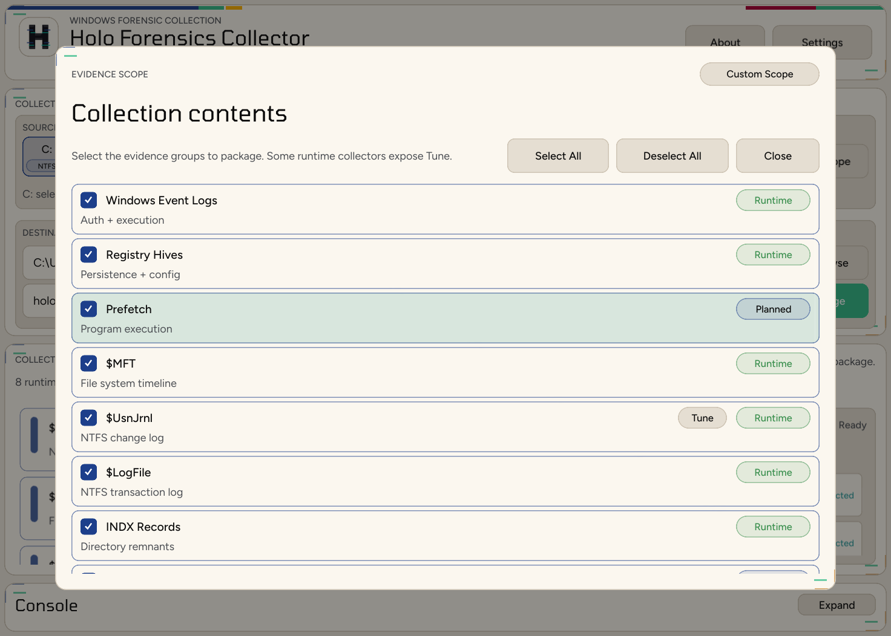
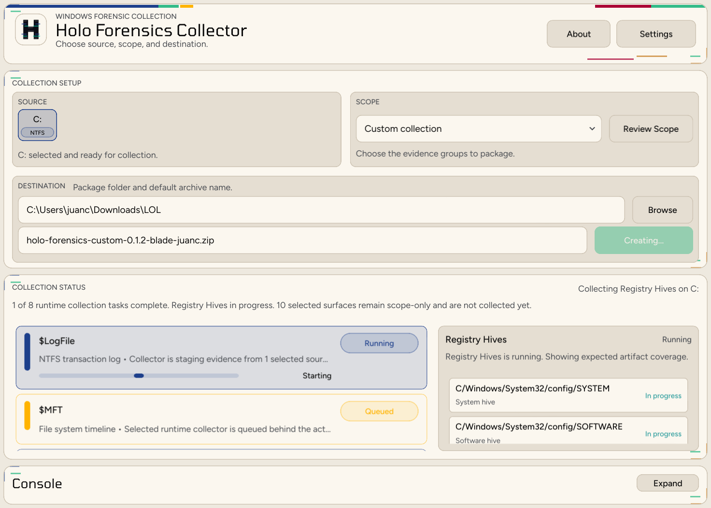

<p align="center">
  
</p>

# Holo Forensics

Consistent Windows forensic collection and offline artifact parsing in one Rust codebase.

<picture>
  <source media="(prefers-color-scheme: dark)" srcset="assets/screenshots/holo-forensics-collection-ready-dark.png">
  <source media="(prefers-color-scheme: light)" srcset="assets/screenshots/holo-forensics-collection-ready-light.png">
  
</picture>

Holo Forensics is a Windows-first forensic workbench for two jobs investigators perform repeatedly: collecting live evidence into a stable package, and parsing supported evidence into reviewable JSONL.

Most people should start with the desktop app. The UI walks through source selection, evidence-scope review, package destination, collection progress, parse planning, and settings without hiding the runtime artifacts written underneath.

The same Rust runtime also powers the CLI for labs, automation, and validation, but the main workflow is designed around the desktop experience.

## Start With The Desktop App

Download the latest Windows release from the [latest release page](https://github.com/false00/holoForensics/releases/latest).

If you are evaluating Holo Forensics or using it for casework, start with the packaged desktop build instead of building from source.

Then follow the normal operator flow:

1. Choose the source volume you want to collect from.
2. Review or customize the evidence scope before packaging.
3. Pick the destination folder and create the evidence package.
4. Use Parse Mode in the UI when you want to inspect and parse an existing evidence zip.

If you want source-build, CLI, or lab-validation details, use the [wiki home technical reference](holoForensics.wiki/Home.md#technical-reference).

The desktop UI gives analysts a focused Windows collection workflow with source selection, scope review, package destination, live collector status, and artifact-level progress.

<picture>
  <source media="(prefers-color-scheme: dark)" srcset="assets/screenshots/holo-forensics-scope-review-dark.png">
  <source media="(prefers-color-scheme: light)" srcset="assets/screenshots/holo-forensics-scope-review-light.png">
  
</picture>

The scope dialog makes it clear which evidence groups are live today, which are planned, and where tuneable collection options exist before you start acquisition.

## Desktop UI Preview

<picture>
  <source media="(prefers-color-scheme: dark)" srcset="assets/screenshots/holo-forensics-collection-progress-dark.png">
  <source media="(prefers-color-scheme: light)" srcset="assets/screenshots/holo-forensics-collection-progress-light.png">
  
</picture>

The collection view is built for Windows acquisition: choose a source volume, confirm the scope, set the package destination, and watch each collector move from queued to staged or complete.

The app also includes Parse Mode for existing evidence archives, settings for theme and search defaults, and recovery prompts for shadow copies that were created by earlier collection runs.

## Why This Exists

- One-language implementation for Windows collection and parsing, without PowerShell or batch wrapper chains as the core runtime
- Consistent collection archives with preserved Windows paths, SHA-256 hashes, centralized manifests, and explicit collector metadata
- Forensically careful acquisition paths, including VSS-backed collection where live file access is unreliable or unsafe
- Offline-first parsing for collection zips, so analysis can run away from the source endpoint
- Native Rust parser families built into the binary, with clear artifact-to-parser mappings
- JSONL output that is easy to post-process, diff, review, or ingest into search systems

## Current Windows Coverage

Holo Forensics has two separate jobs: **Create Package** collects Windows artifacts into a preserved zip layout, and **Parse Mode** turns supported artifacts into JSONL. Some collected artifacts are preserved for later analysis even if Holo does not parse them yet.

Parse Mode also recognizes parser-only raw-input contracts for Windows BITS, Windows Search, Outlook stores, Shim databases, restore-point logs, and Windows Timeline when those files already exist inside the evidence package.

In the parity column below, `✅` means Create Package and Parse Mode both cover that Windows surface today. `🕒` means one side exists today, but the matching collector or parser is still missing.

### Collects Today

| Parity | Surface | What is collected |
| :---: | --- | --- |
| ✅ | Windows Event Logs | `C:\Windows\System32\winevt\Logs\*.evtx`, including archived EVTX logs |
| ✅ | Registry Hives | System hives, user hives, service-profile hives, AmCache, BCD, and registry transaction logs |
| ✅ | Prefetch | `C:\Windows\Prefetch\*.pf`, `Layout.ini`, and `Ag*.db` from a VSS snapshot, with timestamps, file attributes, and SHA-256 metadata |
| ✅ | Scheduled Tasks | `C:\Windows\Tasks\**`, `C:\Windows\SchedLgU.txt`, and `C:\Windows\System32\Tasks\**` from a VSS snapshot, preserved raw with directory metadata and SHA-256 verification |
| ✅ | WMI Repository | `C:\Windows\System32\wbem\Repository*\**`, `C:\Windows\System32\wbem\AutoRecover\**`, and top-level `C:\Windows\System32\wbem\*.mof` / `*.mfl` from a VSS snapshot, preserved raw with directory metadata, SHA-256 verification, and no registry or EVTX duplication |
| 🕒 | PowerShell Activity | PSReadLine history, user profile scripts, likely transcript files, and selected script/config files from user PowerShell roots in a VSS snapshot, with skipped-file logging and no registry or EVTX duplication |
| ✅ | Browser Artifacts | Chrome, Edge, Firefox, legacy Edge/WebCache, DPAPI support material, and supporting hives |
| ✅ | Jump Lists | Per-user AutomaticDestinations and CustomDestinations plus `jump_lists_manifest.jsonl` |
| ✅ | LNK Files | Recent, Office Recent, Desktop, and Start Menu `.lnk` files from a VSS snapshot, preserved raw with `lnk_manifest.jsonl` and no shortcut-target resolution |
| ✅ | Recycle Bin | Raw VSS snapshot copy of `C:\$Recycle.Bin` and legacy `C:\Recycler`, including root-level files, SID folders, `$I`, `$R`, `INFO2`, and `recycle_bin_manifest.jsonl` |
| ✅ | SRUM | `C:\Windows\System32\sru\*` plus SOFTWARE and SYSTEM hives |
| ✅ | `$MFT` | NTFS `$MFT` through VSS raw-NTFS extraction |
| 🕒 | `$LogFile` | NTFS `$LogFile` through VSS raw-NTFS extraction |
| 🕒 | INDX Records | Raw NTFS `$I30` index attributes from directory records |
| ✅ | `$UsnJrnl` | `$Extend\$UsnJrnl:$J` with sidecar or centralized collector metadata |

Create Package preserves original Windows paths where applicable, hashes collected bytes with SHA-256, and writes collector metadata under `$metadata/collectors/<volume>/<collector>/`. Recycle Bin collection preserves the raw modern and legacy on-disk structure; Parse Mode covers modern `$I*` metadata through `windows_recycle_bin` and XP `INFO2` through `windows_recycle_bin_info2`.

### Parses Today

| Parity | Parser family | Artifact support | Collection/input contract |
| :---: | --- | --- | --- |
| ✅ | `windows_browser_history` | Chrome, Edge, and Firefox local browser history databases | `windows_browser_artifacts_collection` |
| ✅ | `windows_event_logs` | Active and archived `.evtx` event logs | `windows_evtx_collection` |
| ✅ | `windows_prefetch` | Windows Prefetch `.pf` files | `windows_prefetch_collection` |
| 🕒 | `windows_bits` | BITS job databases `qmgr.db`, `qmgr0.dat`, and `qmgr1.dat` | Parser-only `windows_bits_collection` |
| 🕒 | `windows_search` | Windows Search databases `Windows.edb` and `Windows.db` | Parser-only `windows_search_collection` |
| 🕒 | `windows_outlook` | Outlook `.ost` and `.pst` stores | Parser-only `windows_outlook_collection` |
| 🕒 | `windows_shimdb` | Application compatibility `.sdb` databases | Parser-only `windows_shimdb_collection` |
| ✅ | `windows_userassist` | UserAssist registry data from `NTUSER.DAT` | `windows_registry_collection` |
| ✅ | `windows_shimcache` | ShimCache/AppCompatCache data from `SYSTEM` | `windows_registry_collection` |
| ✅ | `windows_shellbags` | Shellbags from `NTUSER.DAT` and `USRCLASS.DAT` | `windows_registry_collection` |
| ✅ | `windows_amcache` | `Amcache.hve` execution and install inventory | `windows_registry_collection` |
| ✅ | `windows_shortcuts` | Windows shortcut `.lnk` files | `windows_lnk_collection` |
| ✅ | `windows_srum` | `SRUDB.dat` SRUM records | `windows_srum_collection` |
| ✅ | `windows_users` | Local user and RID data from `SAM` | `windows_registry_collection` |
| ✅ | `windows_services` | Service configuration data from `SYSTEM` | `windows_registry_collection` |
| ✅ | `windows_jump_lists` | AutomaticDestinations and CustomDestinations Jump Lists | `windows_jump_lists_collection` |
| ✅ | `windows_recycle_bin` | Modern Recycle Bin `$I*` metadata files | `windows_recycle_bin_info2_collection` |
| ✅ | `windows_scheduled_tasks` | Legacy `.job` tasks and modern task files under `System32\Tasks` | `windows_scheduled_tasks_collection` |
| ✅ | `windows_wmi_persistence` | WMI persistence data from repository `OBJECTS.DATA` | `windows_wmi_repository_collection` |
| ✅ | `windows_mft` | Raw NTFS `$MFT` evidence | `windows_mft_collection` |
| ✅ | `windows_usn_journal` | Raw NTFS `$Extend\$UsnJrnl:$J` streams, including sidecar-aware sparse-range parsing for USN record versions 2 and 3 | `windows_usn_journal_collection` |
| ✅ | `windows_registry` | Offline Windows Registry hives including `NTUSER.DAT`, `UsrClass.dat`, `Amcache.hve`, `SYSTEM`, `SOFTWARE`, `SAM`, `SECURITY`, `DEFAULT`, `COMPONENTS`, `settings.dat`, and `drvindex.dat` | `windows_registry_collection` |
| 🕒 | `windows_restore_point_log` | Windows restore-point `rp.log` | Parser-only `windows_restore_point_log_collection` |
| ✅ | `windows_recycle_bin_info2` | Windows XP recycle-bin `INFO2` | `windows_recycle_bin_info2_collection` |
| 🕒 | `windows_timeline` | Windows Timeline `ActivitiesCache.db` | Parser-only `windows_timeline_collection` |

### Parity Gaps To Close

Collector exists, matching parser is still missing:

- `windows_powershell_activity_collection`
- `windows_logfile_collection`
- `windows_indx_collection`

Parser exists, matching live collector is still missing:

- `windows_bits` -> `windows_bits_collection`
- `windows_search` -> `windows_search_collection`
- `windows_outlook` -> `windows_outlook_collection`
- `windows_shimdb` -> `windows_shimdb_collection`
- `windows_restore_point_log` -> `windows_restore_point_log_collection`
- `windows_timeline` -> `windows_timeline_collection`

Most of the additional Windows parser families run through the shared adapter in `src/parsers/windows/artemis.rs` and a vendored Artemis v0.19.0 workspace under `third_party/artemis`. That local fork preserves the existing Holo Forensics plan, manifest, and JSONL output contracts while keeping the Windows offline-file fixes in-repo. Create Package does not yet collect parser-only inputs for BITS, Windows Search, Outlook stores, Shim databases, restore-point logs, or Windows Timeline, and Parse Mode does not yet have matching parser families for PowerShell Activity, `$LogFile`, or INDX collector output.

## Getting Started

### Prerequisites

- Rust stable with Cargo

### What The Desktop App Supports

The desktop UI supports:

- Collection section: `Full`, `Triage`, and `Custom` profiles are exposed in the UI. The Collection tab presents the Windows collection surfaces listed above, with available live collectors for event logs, registry, Prefetch, Scheduled Tasks, WMI Repository, PowerShell Activity, browser artifacts, Jump Lists, LNK Files, Recycle Bin, SRUM, `$MFT`, `$LogFile`, INDX records, and `$UsnJrnl`.
- Collection workflow section: when multiple VSS-backed collectors run for the same volume, the package workflow reuses one shared point-in-time VSS snapshot so related artifacts stay aligned.
- Parse Mode section: inspect a selected zip, detect supported artifact groups, choose which detected groups to run, and write parser results without blocking the UI.
- Settings section: persist theme and Elasticsearch destination defaults. The password remains session-local.
- Failure handling section: collection and parse failures surface through desktop error dialogs, and startup failures before Slint is ready fall back to a native Windows error dialog with the technical log path.
- Runtime safety section: VSS shadow copies created by Holo Forensics are tracked under `~/.holo-forensics/vss-shadow-copies.json`. If the app starts and those tracked snapshots still exist, the desktop UI prompts to keep them for reuse or delete them before continuing.

If you want advanced CLI workflows, release-build steps, or collector command details, use the [wiki home technical reference](holoForensics.wiki/Home.md#technical-reference).

## Output Layout

Each run writes:

```text
output/<collection-name>/
  extracted/
  results/
    <family>/
      *.jsonl
      *.log
  manifest.json
```

`manifest.json` records enabled parser families, bound collections, parser plans, outputs, logs, and per-plan status.

## Repository Layout

- `src/` -> active Rust CLI and runtime
- `src/collection_catalog.rs` -> built-in collection catalog and parser-to-collection validation
- `src/collections/windows/` -> live Windows collector implementations for browser artifacts, EVTX, Jump Lists, LNK Files, PowerShell Activity, Prefetch, Recycle Bin, Scheduled Tasks, WMI Repository, registry, `$MFT`, `$LogFile`, INDX records, SRUM, and `$UsnJrnl`
- `src/parsers/windows/` -> native and vendored-Artemis-backed Windows parser implementations for browser history, EVTX, Prefetch, registry-derived artifacts, LNK files, Jump Lists, SRUM, Recycle Bin, Scheduled Tasks, WMI persistence, `$MFT`, USN journal, restore-point logs, XP recycle-bin `INFO2`, and Windows Timeline
- `third_party/artemis/` -> vendored Artemis v0.19.0 workspace maintained in-repo for Windows offline parsing fixes
- `src/parser_catalog.rs` -> built-in parser family catalog
- `holoForensics.wiki/` -> parser and collection documentation

## Documentation

- [User and operator guide, including CLI reference](holoForensics.wiki/Home.md)
- [Parser wiki](holoForensics.wiki/parsers/README.md)
- [Collection wiki](holoForensics.wiki/collections/README.md)

## License

- Project source: [Apache License 2.0](LICENSE)
- Vendored and bundled third-party software: [Third-party notices](THIRD_PARTY_NOTICES.md)

## Limitations

- Windows-focused collection and parsing
- Offline parsing only
- Some UI collection surfaces are planned and not yet implemented
- Parser and collector coverage is limited to the families listed above
