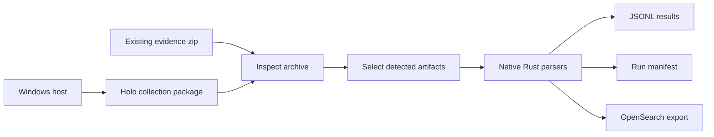

# Holo Forensics

Holo Forensics is a Rust-native digital forensics workbench for turning Windows, Linux, and macOS evidence into reviewable timelines, structured JSONL, and search-ready records.

It is built for investigators who need the speed of a local desktop tool, the repeatability of a command-line pipeline, and the confidence that every output came from a documented evidence contract.

## What It Delivers

- **Live evidence packaging** for high-value Windows artifacts including Registry hives, Event Logs, Prefetch, Scheduled Tasks, PowerShell Activity, browser artifacts, Jump Lists, LNK Files, Recycle Bin, `$MFT`, `$LogFile`, INDX records, SRUM, and `$UsnJrnl`.
- **Offline collection parsing** for zipped evidence packages, with automatic artifact detection and native parser dispatch.
- **Traceable output** through JSONL result files, parser logs, SHA-256 metadata, and run manifests.
- **Desktop and CLI workflows** backed by the same Rust runtime.
- **OpenSearch-compatible export** for teams that want immediate search, filtering, dashboards, and long-running case review.
- **Documented parser and collection contracts** so new artifacts can be added without turning the project into an opaque one-off script bundle.

## Why It Matters

Most DFIR tools make a hard tradeoff: they are either friendly but hard to automate, scriptable but fragile, or powerful but difficult to inspect. Holo Forensics is designed around a different contract:

1. Collect evidence with path-preserving archive layouts.
2. Record exactly how each artifact was acquired.
3. Parse only supported artifacts with native implementations.
4. Emit plain, durable outputs that can be diffed, searched, indexed, or reviewed without the original UI.
5. Keep every parser and collector documented beside the code that ships it.

That makes the project practical for solo investigations, lab validation, incident response handoff, and repeatable enterprise evidence processing.

## Investigator Workflow



## Desktop Experience

The desktop application focuses on the work investigators repeat most:

- Choose one or more NTFS-backed volumes.
- Review an evidence scope before collection.
- Package live artifacts through the Rust collectors.
- Inspect an evidence zip and select detected parser groups.
- Parse in the background while progress, logs, and final output paths remain visible.
- Surface collection and parse failures in modal error dialogs, with a native Windows fallback if startup fails before the UI is ready.
- Persist operator preferences such as theme, output locations, and search defaults.

The desktop is not a thin wrapper around shell scripts. It calls the same runtime paths used by the CLI, including shared VSS snapshot handling, tracked shadow-copy recovery, archive packaging, parser planning, and manifest generation.

## Desktop-First Quick Start

Most operators should use the desktop workflow first:

1. Start the app from the repo root.
2. Choose the source volume.
3. Review the evidence scope.
4. Choose the package destination and create the archive.
5. Use Parse Mode in the UI to inspect and parse an existing evidence zip.

Launch the desktop app:

```powershell
cargo run
```

Launch the UI explicitly if you need the named subcommand:

```powershell
cargo run -- ui
```

## Runtime Capabilities

### Live Windows Collectors

| Evidence surface | Runtime status | Output contract |
| --- | --- | --- |
| Registry Hives | Available | VSS snapshot hive and transaction-log collection with centralized metadata |
| Windows Event Logs | Available | VSS snapshot copy of active and archived `.evtx` logs |
| Prefetch | Available | VSS snapshot copy of `.pf`, `Layout.ini`, and `Ag*.db` with timestamps, file attributes, and SHA-256 metadata |
| Scheduled Tasks | Available | VSS snapshot raw copy of legacy `Windows\Tasks`, `SchedLgU.txt`, and modern `Windows\System32\Tasks` with directory metadata and SHA-256 verification |
| WMI Repository | Available | VSS snapshot raw copy of `Repository*`, `AutoRecover`, and top-level `.mof` / `.mfl` WBEM content with directory metadata and SHA-256 verification |
| PowerShell Activity | Available | VSS snapshot copy of PSReadLine history, PowerShell profile scripts, likely transcripts, and selected user PowerShell support files with skipped-file logging |
| `$MFT` | Available | VSS raw NTFS extraction with SHA-256 metadata |
| `$LogFile` | Available | VSS raw NTFS extraction with SHA-256 metadata |
| INDX Records | Available | Rawpack of `$INDEX_ROOT`, `$INDEX_ALLOCATION`, and `$BITMAP` records |
| SRUM | Available | VSS snapshot copy of SRU data plus supporting hives |
| Browser Artifacts | Available | Targeted browser database, session, storage, extension, DPAPI, and hive support material |
| Jump Lists | Available | VSS snapshot copy of per-user AutomaticDestinations and CustomDestinations plus `jump_lists_manifest.jsonl` |
| LNK Files | Available | VSS snapshot copy of Recent, Office Recent, Desktop, and Start Menu `.lnk` files plus `lnk_manifest.jsonl`, without shortcut-target resolution |
| Recycle Bin | Available | VSS snapshot raw copy of `$Recycle.Bin` and `Recycler`, including `$I`, `$R`, `INFO2`, root-level files, and `recycle_bin_manifest.jsonl` |
| `$UsnJrnl` | Available | Direct stream, VSS stream, and VSS raw NTFS acquisition with active-window and sparse modes |

The live Recycle Bin collector preserves both modern and legacy raw structures. Parse Mode now covers modern `$I*` metadata through `windows_recycle_bin` and legacy XP `INFO2` through `windows_recycle_bin_info2`.

When multiple VSS-backed collectors run for the same volume, the archive workflow uses a shared point-in-time snapshot so related artifacts line up cleanly in time.

The desktop startup path also reconciles previously tracked shadow copies and prompts the operator to keep or delete them before continuing.

### Native Parser Families

| Parser family | Platform | Evidence |
| --- | --- | --- |
| `windows_browser_history` | Windows | Chrome, Edge, and Firefox history |
| `windows_event_logs` | Windows | Active and archived `.evtx` event logs |
| `windows_prefetch` | Windows | Windows Prefetch `.pf` files |
| `windows_bits` | Windows | BITS databases `qmgr.db`, `qmgr0.dat`, and `qmgr1.dat` |
| `windows_search` | Windows | Windows Search databases `Windows.edb` and `Windows.db` |
| `windows_outlook` | Windows | Outlook `.ost` and `.pst` stores |
| `windows_shimdb` | Windows | Application compatibility `.sdb` databases |
| `windows_userassist` | Windows | UserAssist data from `NTUSER.DAT` |
| `windows_shimcache` | Windows | ShimCache/AppCompatCache data from `SYSTEM` |
| `windows_shellbags` | Windows | Shellbags from `NTUSER.DAT` and `USRCLASS.DAT` |
| `windows_amcache` | Windows | `Amcache.hve` execution and install inventory |
| `windows_shortcuts` | Windows | Windows shortcut `.lnk` files |
| `windows_srum` | Windows | `SRUDB.dat` SRUM records |
| `windows_users` | Windows | Local user and RID data from `SAM` |
| `windows_services` | Windows | Service configuration data from `SYSTEM` |
| `windows_jump_lists` | Windows | AutomaticDestinations and CustomDestinations Jump Lists |
| `windows_recycle_bin` | Windows | Modern Recycle Bin `$I*` metadata files |
| `windows_scheduled_tasks` | Windows | Legacy `.job` tasks and modern task files under `System32\Tasks` |
| `windows_wmi_persistence` | Windows | WMI persistence data from repository `OBJECTS.DATA` |
| `windows_mft` | Windows | Raw NTFS `$MFT` evidence |
| `windows_usn_journal` | Windows | Raw NTFS `$Extend\$UsnJrnl:$J` records |
| `windows_registry` | Windows | Offline registry hives |
| `windows_restore_point_log` | Windows | Restore-point `rp.log` |
| `windows_recycle_bin_info2` | Windows | Windows XP recycle-bin `INFO2` |
| `windows_timeline` | Windows | Windows Timeline `ActivitiesCache.db` |
| `linux_shell_history` | Linux | `.bash_history` and `.zsh_history` |
| `macos_browser_history` | macOS | Chrome history |
| `macos_quarantine_events` | macOS | Quarantine events database |

Most of the additional Windows parser families are routed through the shared adapter in `src/parsers/windows/artemis.rs` and a vendored Artemis v0.16.0 workspace under `third_party/artemis`, while preserving the existing Holo Forensics plan and output contract. The vendored fork keeps the Windows offline-file fixes in-repo for explicit evidence paths. `windows_bits_collection`, `windows_search_collection`, `windows_outlook_collection`, and `windows_shimdb_collection` are parser-only raw-input contracts today.

Each parser family is bound to an explicit collection contract and documented in the [Parser index](parsers/README.md).

## Output Model

Every parse run writes a simple evidence-processing record:

```text
output/<collection-name>/
  extracted/
  results/
    <parser-family>/
      *.jsonl
      *.log
  manifest.json
```

The JSONL files are intentionally boring: one record per line, easy to stream, easy to test, and easy to index. The manifest records parser families, collection bindings, planned artifacts, output files, logs, statuses, and export counts.

Collection archives use path-preserving artifact layouts with centralized collector metadata:

```text
<collection>.zip
  C/
    Windows/
    Users/
    $Extend/
    $MFT.bin
    $LogFile.bin
    INDX.rawpack
  $metadata/
    collectors/
      C/
        windows_registry/
          manifest.json
          collection.log
        windows_usn_journal/
          manifest.json
```

## Technical Reference

The README is intentionally desktop-first. This page keeps the lower-level commands, validation steps, and CLI examples in one place for operators, testers, and maintainers.

### Repo Validation

```powershell
cargo fmt --check
cargo test --locked
```

### Parse An Existing Archive From The CLI

```powershell
cargo run -- --input C:\evidence\case-001.zip --output C:\cases\case-001\holo-output
```

For a non-interactive parse validation run:

```powershell
cargo run -- ui --validate-parse C:\path\to\collection.zip --validate-output output\ui-parse-validation
```

### Live Collector Commands

Most collection commands require an elevated shell or `--elevate`. The desktop UI uses the same collectors when it creates a package.

Registry:

```powershell
cargo run -- collect-registry --volume C: --out-dir C:\temp\registry --elevate
```

USN Journal:

```powershell
cargo run -- collect-usn-journal --volume C: --out C:\temp\C_usn_journal_J.bin --elevate
```

The default USN mode is VSS raw-NTFS and writes the active journal window with metadata that preserves original stream offsets. Sparse logical output is available when needed:

```powershell
cargo run -- collect-usn-journal --volume C: --out C:\temp\C_usn_journal_J.bin --mode vss-raw-ntfs --sparse --elevate
```

Other collectors:

```powershell
cargo run -- collect-evtx --volume C: --out-dir C:\temp\evtx --elevate
cargo run -- collect-prefetch --volume C: --out-dir C:\temp\prefetch --elevate
cargo run -- collect-scheduled-tasks --volume C: --out-dir C:\temp\scheduled-tasks --elevate
cargo run -- collect-powershell-activity --volume C: --out-dir C:\temp\powershell-activity --elevate
cargo run -- collect-browser-artifacts --volume C: --out-dir C:\temp\browser --elevate
cargo run -- collect-jump-lists --volume C: --out-dir C:\temp\jump-lists --elevate
cargo run -- collect-lnk --volume C: --out-dir C:\temp\lnk --elevate
cargo run -- collect-recycle-bin --volume C: --out-dir C:\temp\recycle-bin --elevate
cargo run -- collect-srum --volume C: --out-dir C:\temp\srum --elevate
cargo run -- collect-mft --volume C: --out-dir C:\temp\mft --elevate
cargo run -- collect-logfile --volume C: --out-dir C:\temp\logfile --elevate
cargo run -- collect-indx --volume C: --out-dir C:\temp\indx --elevate
```

### Production Build

Build the Windows release binary from a Windows shell with the Rust stable toolchain and MSVC build tools available:

```powershell
cargo build --release --locked
```

Run it with the search destination environment:

```powershell
$env:ELASTIC_SEARCH_HOST = "127.0.0.1"
$env:ELASTIC_SEARCH_PORT = "9200"
$env:ELASTIC_SEARCH_USERNAME = "<elastic-username>"
$env:ELASTIC_SEARCH_PASSWORD = "<elastic-password>"

.\target\release\holo-forensics.exe `
  --input C:\data\collections\input.zip `
  --output C:\data\holo-output\run
```

The development and release binaries accept the same CLI flags.

Useful flags:

- `--input` -> required collection zip path
- `--output` -> output directory; defaults to `output/<zip-stem>`
- `--opensearch-url` -> OpenSearch-compatible base URL for bulk export
- `--opensearch-username` / `--opensearch-password` -> optional basic auth credentials
- `--opensearch-index` -> optional explicit destination index name

The CLI also understands:

- `ELASTIC_SEARCH_HOST`
- `ELASTIC_SEARCH_PORT`
- `ELASTIC_SEARCH_USERNAME`
- `ELASTIC_SEARCH_PASSWORD`

If export is enabled and no index name is provided, the CLI generates an `l2t-<mode>-<collection>-<timestamp>` index name.

### Local Search Validation

To stand up a single-node search target for local development, use `docker-compose.search.yml`:

```powershell
docker compose -f docker-compose.search.yml up -d
```

### Security And Repo Hygiene

- Generated output, caches, local binaries, and intake collections are intentionally excluded from version control.
- Do not use this repo as a storage location for case data, external collections, or parser output.
- Keep sensitive examples outside the repo and document only the minimum needed findings.

## Architecture

Holo Forensics is organized around explicit runtime contracts instead of implicit file globs:

- `src/collections/` contains live collector implementations.
- `src/collection_catalog.rs` registers collection contracts.
- `src/parsers/` contains native parser implementations.
- `src/parser_catalog.rs` binds parser families to collection contracts.
- `src/manifest.rs` records run-level parse output.
- `src/opensearch.rs` handles OpenSearch-compatible bulk export.
- `ui/` contains the Slint desktop interface.
- `holoForensics.wiki/` documents every shipped parser and collection contract.

The result is a project that can grow artifact coverage without losing auditability.

## Project Principles

- **Offline first:** parsing works from archived evidence without live host access.
- **Evidence honest:** collection metadata records what was copied, hashed, skipped, or failed.
- **Native where it counts:** core collection and parser paths are implemented in Rust.
- **Operator friendly:** the desktop exposes common workflows without hiding the underlying output.
- **Automation ready:** the CLI is suitable for repeatable lab, case, and pipeline use.
- **Documentation bound to runtime:** parser and collection changes are incomplete until the wiki changes with them.

## Wiki Index

- [Parser index](parsers/README.md)
- [Collection index](collections/README.md)
- [Windows parsers](parsers/windows/README.md)
- [Windows collections](collections/windows/README.md)
- [Generic parsers](parsers/generic/README.md)

## Maintainer Contract

This wiki is part of the runtime surface. Keep it synchronized with the code:

- Every active parser family must have exactly one parser page.
- Every active collection contract must have exactly one collection page.
- Parser additions, removals, renames, input changes, schema changes, validation changes, and major performance changes must update the matching wiki page.
- Collection additions, removals, renames, contract changes, implementation-status changes, archive layout changes, and manifest schema changes must update the matching wiki page.
- Parser indexes must stay aligned with `src/parser_catalog.rs`.
- Collection indexes must stay aligned with `src/collection_catalog.rs`.
- Documentation changes should land in the same commit as the runtime change whenever possible.
