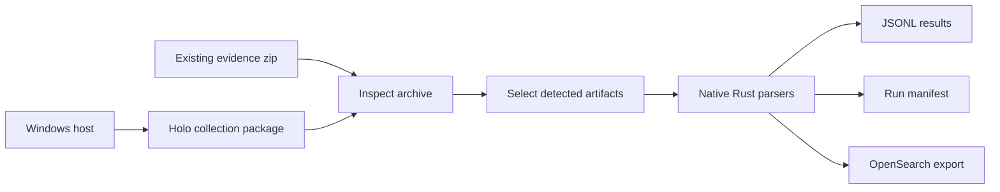

# Holo Forensics

Holo Forensics is a Rust-native digital forensics workbench for turning Windows, Linux, and macOS evidence into reviewable timelines, structured JSONL, and search-ready records.

It is built for investigators who need the speed of a local desktop tool, the repeatability of a command-line pipeline, and the confidence that every output came from a documented evidence contract.

## What It Delivers

- **Live evidence packaging** for high-value Windows artifacts including Registry hives, Event Logs, `$MFT`, `$LogFile`, INDX records, SRUM, browser artifacts, and `$UsnJrnl`.
- **Offline collection parsing** for zipped evidence packages, with automatic artifact detection and native parser dispatch.
- **Traceable output** through JSONL result files, parser logs, SHA-256 metadata, and run manifests.
- **Desktop and CLI workflows** backed by the same Rust runtime.
- **OpenSearch-compatible export** for teams that want immediate search, filtering, dashboards, and long-running case review.
- **Documented parser and collection contracts** so new artifacts can be added without turning the project into an opaque one-off script bundle.

## Why It Matters

Most DFIR tools make a hard tradeoff: they are either friendly but hard to automate, scriptable but fragile, or powerful but difficult to inspect. Holo Forensics is designed around a different contract:

1. Collect evidence with path-preserving archive layouts.
2. Record exactly how each artifact was acquired.
3. Parse only supported artifacts with native implementations.
4. Emit plain, durable outputs that can be diffed, searched, indexed, or reviewed without the original UI.
5. Keep every parser and collector documented beside the code that ships it.

That makes the project practical for solo investigations, lab validation, incident response handoff, and repeatable enterprise evidence processing.

## Investigator Workflow



## Desktop Experience

The desktop application focuses on the work investigators repeat most:

- Choose one or more NTFS-backed volumes.
- Review an evidence scope before collection.
- Package live artifacts through the Rust collectors.
- Inspect an evidence zip and select detected parser groups.
- Parse in the background while progress, logs, and final output paths remain visible.
- Persist operator preferences such as theme, output locations, and search defaults.

The desktop is not a thin wrapper around shell scripts. It calls the same runtime paths used by the CLI, including shared VSS snapshot handling, archive packaging, parser planning, and manifest generation.

## Runtime Capabilities

### Live Windows Collectors

| Evidence surface | Runtime status | Output contract |
| --- | --- | --- |
| Registry Hives | Available | VSS snapshot hive and transaction-log collection with centralized metadata |
| Windows Event Logs | Available | VSS snapshot copy of active and archived `.evtx` logs |
| `$MFT` | Available | VSS raw NTFS extraction with SHA-256 metadata |
| `$LogFile` | Available | VSS raw NTFS extraction with SHA-256 metadata |
| INDX Records | Available | Rawpack of `$INDEX_ROOT`, `$INDEX_ALLOCATION`, and `$BITMAP` records |
| SRUM | Available | VSS snapshot copy of SRU data plus supporting hives |
| Browser Artifacts | Available | Targeted browser database, session, storage, extension, DPAPI, and hive support material |
| `$UsnJrnl` | Available | Direct stream, VSS stream, and VSS raw NTFS acquisition with active-window and sparse modes |

When multiple VSS-backed collectors run for the same volume, the archive workflow uses a shared point-in-time snapshot so related artifacts line up cleanly in time.

### Native Parser Families

| Parser family | Platform | Evidence |
| --- | --- | --- |
| `windows_browser_history` | Windows | Chrome, Edge, and Firefox history |
| `windows_usn_journal` | Windows | Raw NTFS `$Extend\$UsnJrnl:$J` records |
| `windows_registry` | Windows | Offline registry hives |
| `windows_restore_point_log` | Windows | Restore-point `rp.log` |
| `windows_recycle_bin_info2` | Windows | Windows XP recycle-bin `INFO2` |
| `windows_timeline` | Windows | Windows Timeline `ActivitiesCache.db` |
| `linux_shell_history` | Linux | `.bash_history` and `.zsh_history` |
| `macos_browser_history` | macOS | Chrome history |
| `macos_quarantine_events` | macOS | Quarantine events database |

Each parser family is bound to an explicit collection contract and documented in the [Parser index](parsers/README.md).

## Output Model

Every parse run writes a simple evidence-processing record:

```text
output/<collection-name>/
  extracted/
  results/
    <parser-family>/
      *.jsonl
      *.log
  manifest.json
```

The JSONL files are intentionally boring: one record per line, easy to stream, easy to test, and easy to index. The manifest records parser families, collection bindings, planned artifacts, output files, logs, statuses, and export counts.

Collection archives use path-preserving artifact layouts with centralized collector metadata:

```text
<collection>.zip
  C/
    Windows/
    Users/
    $Extend/
    $MFT.bin
    $LogFile.bin
    INDX.rawpack
  $metadata/
    collectors/
      C/
        windows_registry/
          manifest.json
          collection.log
        windows_usn_journal/
          manifest.json
```

## Quick Start

Run the desktop application:

```powershell
cargo run
```

Parse an existing evidence archive from the CLI:

```powershell
cargo run -- --input C:\evidence\case-001.zip --output C:\cases\case-001\holo-output
```

Collect a live Windows evidence package from the desktop, or call individual collectors directly:

```powershell
cargo run -- collect-registry --volume C: --out-dir C:\cases\case-001\registry --elevate
cargo run -- collect-usn-journal --volume C: --out C:\cases\case-001\C_usn_journal_J.bin --elevate
```

Run validation:

```powershell
cargo fmt --check
cargo test
```

## Architecture

Holo Forensics is organized around explicit runtime contracts instead of implicit file globs:

- `src/collections/` contains live collector implementations.
- `src/collection_catalog.rs` registers collection contracts.
- `src/parsers/` contains native parser implementations.
- `src/parser_catalog.rs` binds parser families to collection contracts.
- `src/manifest.rs` records run-level parse output.
- `src/opensearch.rs` handles OpenSearch-compatible bulk export.
- `ui/` contains the Slint desktop interface.
- `holoForensics.wiki/` documents every shipped parser and collection contract.

The result is a project that can grow artifact coverage without losing auditability.

## Project Principles

- **Offline first:** parsing works from archived evidence without live host access.
- **Evidence honest:** collection metadata records what was copied, hashed, skipped, or failed.
- **Native where it counts:** core collection and parser paths are implemented in Rust.
- **Operator friendly:** the desktop exposes common workflows without hiding the underlying output.
- **Automation ready:** the CLI is suitable for repeatable lab, case, and pipeline use.
- **Documentation bound to runtime:** parser and collection changes are incomplete until the wiki changes with them.

## Wiki Index

- [Parser index](parsers/README.md)
- [Collection index](collections/README.md)
- [Windows parsers](parsers/windows/README.md)
- [Windows collections](collections/windows/README.md)
- [Generic parsers](parsers/generic/README.md)

## Maintainer Contract

This wiki is part of the runtime surface. Keep it synchronized with the code:

- Every active parser family must have exactly one parser page.
- Every active collection contract must have exactly one collection page.
- Parser additions, removals, renames, input changes, schema changes, validation changes, and major performance changes must update the matching wiki page.
- Collection additions, removals, renames, contract changes, implementation-status changes, archive layout changes, and manifest schema changes must update the matching wiki page.
- Parser indexes must stay aligned with `src/parser_catalog.rs`.
- Collection indexes must stay aligned with `src/collection_catalog.rs`.
- Documentation changes should land in the same commit as the runtime change whenever possible.
